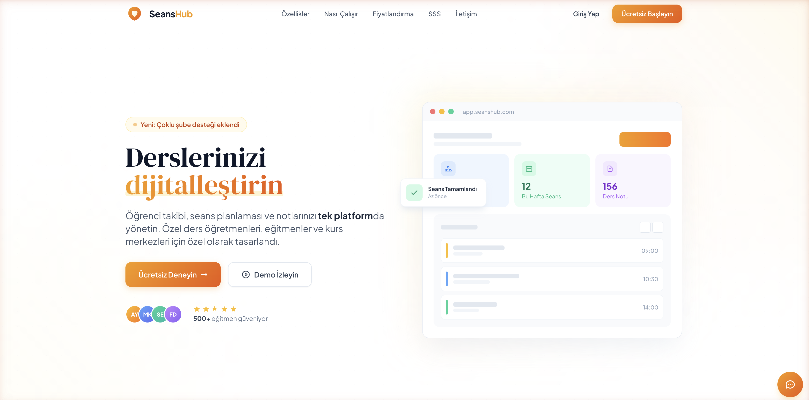

# SeansHub Landing Page

Marketing website for **SeansHub** — a session and student management system designed for private tutors, educators, and training centers.

**Live:** [seanshub.com](https://seanshub.com)



## Features

- Responsive single-page design
- Interactive demo panels (Dashboard, Calendar, Notes)
- 2 pricing plans (Starter / Professional)
- Live chatbot (FAQ)
- Contact form
- SEO optimization (meta, Open Graph, JSON-LD)
- Monthly/Annual pricing toggle

## Tech Stack

- **Vite** - Build tool
- **Tailwind CSS** - Styling framework
- **Vercel** - Hosting & CDN

## Development

```bash
# Install dependencies
npm install

# Development server
npm run dev

# Production build
npm run build

# Preview build
npm run preview
```

## Deployment

This project is hosted on **Vercel**. Pushing to the `main` branch triggers automatic deployment.

**Pipeline:** `git push` → GitHub (`mtasan/seanshub-website`) → Vercel → seanshub.com

**Domain:** DNS managed via Cloudflare, pointing to Vercel.

## Project Structure

```
landing_website/
├── index.html          # Main page
├── src/
│   ├── main.js         # JS entry point
│   └── style.css       # Tailwind CSS
├── public/             # Static assets (favicon, robots.txt)
├── .claude/
│   └── skills/
│       └── ship-saas-website/
│           └── SKILL.md  # SaaS website building skill
├── docs/               # Screenshots
├── dist/               # Build output (gitignored)
├── vercel.json         # Vercel config (headers, caching)
├── vite.config.js      # Vite config
├── tailwind.config.js  # Tailwind config
├── postcss.config.js   # PostCSS config
└── package.json
```

## Claude Code Skills

This project includes the following Claude Code skills:

- **ship-saas-website** — Guide for building professional SaaS marketing websites. Covers hero, features, interactive demo, pricing, FAQ, chatbot, contact form, and SEO optimization.

## Pricing Plans

| Plan | Price | Educators | Students |
|------|-------|-----------|----------|
| Starter | Free | 1 | Up to 5 |
| Professional | 499 TL/mo | Unlimited | Unlimited |
